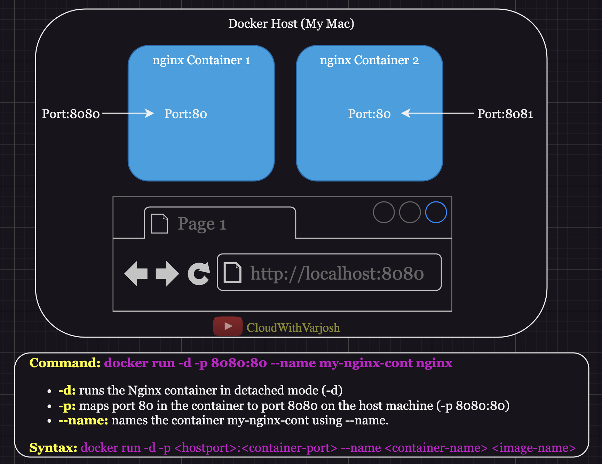

# Day 3: Docker Flags, Deep Dive into Dockerfile, and Exposing Containers | CKA Certification Course 2025


### **Important Docker Flags**



```bash
docker run -d -p 8080:80 --name my-nginx-cont nginx
```

This command performs several key actions:
1. **Detached Mode (`-d`)**:  
   Runs the container in the background, freeing up your terminal for other tasks.  
2. **Port Mapping (`-p 8080:80`)**:  
   Maps port **80** in the container (default Nginx port) to port **8080** on your host machine.  
3. **Container Name (`--name my-nginx-cont`)**:  
   Assigns the container the name `my-nginx-cont` for easier identification and management.  

Once this command is executed, you can access the Nginx default page by opening `http://localhost:8080` in your browser.

---

### **Dockerfile Instructions and Their Purposes**

1. **`FROM`**:  
   Defines the **base image** to build your application.  
   Example: `FROM ubuntu:latest`

2. **`ADD`**:  
   Copies files/directories from the host to the container and automatically extracts archives (e.g., `.tar.gz`).  
   Example: `ADD app.tar.gz /app`

3. **`RUN`**:  
   Executes commands during the image build process (e.g., installing software, configuring files).  
   Example: `RUN apt-get update && apt-get install -y nginx`

4. **`COPY`**:  
   Similar to `ADD` but **only copies files/directories** (no extraction or URL handling).  
   Example: `COPY app.py /app/app.py`

5. **`EXPOSE`**:  
   Documents the port on which the container’s application will listen. Note: It doesn’t actually open the port; you need to use the `-p` flag when running the container.  
   Example: `EXPOSE 5000`

6. **`CMD`**:  
   Specifies the **default command** to run when the container starts. This can be overridden with `docker run <image-name> <command>`.  
   Example: `CMD ["python", "app.py"]`

7. **`ENTRYPOINT`**:  
   Defines the command that will always execute when the container starts. You can append arguments via `docker run <image-name> <arguments>`. To completely override this, use the `--entrypoint` flag.  
   Example: `ENTRYPOINT ["nginx", "-g", "daemon off;"]`

---

### **Example Dockerfile**

Below is an example `Dockerfile` that builds a lightweight Python Flask application:

```dockerfile
# Use a lightweight Python image as the base
FROM python:3.9-slim  

# Set the working directory inside the container
WORKDIR /app  

# Copy the application file from the host to the container
ADD app.py /app/app.py  

# Install the necessary Python library
RUN pip install flask  

# Expose the port where the app will listen
EXPOSE 5000  

# Specify the default command to run the application
CMD ["python", "app.py"]
```

---

### **Shell Form vs Exec Form in `CMD`**

| **Feature**              | **Shell Form**                                      | **Exec Form**                                      |
|--------------------------|-----------------------------------------------------|----------------------------------------------------|
| **Syntax**               | `CMD <command>`                                     | `CMD ["executable", "param1", "param2"]`           |
| **Execution**            | Runs the command through the shell (`/bin/sh -c`).  | Runs the command directly without a shell.         |
| **Environment Variables**| Supports shell expansion and environment variables. | Does not support shell expansion (e.g., `$VAR`).    |
| **PID 1 Signal Handling**| The shell process becomes PID 1, so it can’t receive signals directly. | The specified executable becomes PID 1 and handles signals directly. |
| **Complex Commands**     | Supports more complex commands, like chaining commands with `&&` & `double pipe`. | Best suited for simple commands with no shell features. |
| **Common Use Case**      | When you need shell features, like piping or chaining commands. | When you want the command to run directly and efficiently. |
| **Examples**             | `CMD echo "Hello World"`                           | `CMD ["echo", "Hello World"]`                      |

---
### **Conclusion**

Understanding these Docker flags, Dockerfile instructions, and their nuances is critical for anyone working with containers. From running detached containers with port mappings to defining clear image build instructions in Dockerfiles, these concepts lay the foundation for effective containerized application development. Mastering the differences between `CMD` forms and leveraging Docker’s powerful commands will greatly enhance your ability to create scalable, efficient, and reliable containerized systems.  

Remember, Docker simplifies the development, testing, and deployment process by providing consistency and portability across environments. As you dive deeper, these core concepts will serve as building blocks for more advanced workflows, including multi-container orchestration and CI/CD pipelines. 🚀

---