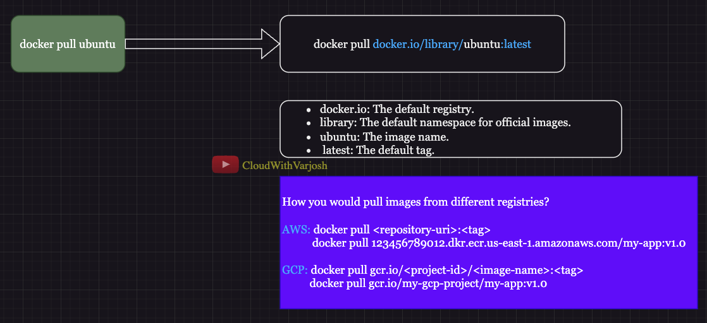

# Day 2: Write Your First Dockerfile, and Push to Docker Hub | CKA Certification Course 2025


## **Understanding `docker pull docker.io/library/ubuntu:latest`**



The command **`docker pull docker.io/library/ubuntu:latest`** fetches the Ubuntu image (specifically the `:latest` tag) from the **Docker Hub default registry** (`docker.io`). By default, if you do not specify a registry or fully qualify the image name, Docker assumes it is hosted on Docker Hub.

But what if you want to pull images from other registries? Let’s explore how to fetch images from different cloud container registries.

---

### **Pulling Images from Other Registries**

#### **1. Pulling Images from AWS Elastic Container Registry (ECR):**
To pull images from AWS ECR:
```bash
docker pull <repository-uri>:<tag>
docker pull 123456789012.dkr.ecr.us-east-1.amazonaws.com/my-app:v1.0
```
- **`<repository-uri>`**: The URI for your private repository hosted in ECR.
- **`<tag>`**: The version or tag of your image (e.g., `v1.0`).
- AWS ECR URIs follow the format:
  ```
  <account-id>.dkr.ecr.<region>.amazonaws.com/<repository-name>:<tag>
  ```
  Example:  
  `123456789012.dkr.ecr.us-east-1.amazonaws.com/my-app:v1.0`

---

#### **2. Pulling Images from Google Container Registry (GCR):**
To pull images from Google Cloud's GCR:
```bash
docker pull gcr.io/<project-id>/<image-name>:<tag>
docker pull gcr.io/my-gcp-project/my-app:v1.0
```
- **`<project-id>`**: The Google Cloud project where your container registry resides.
- **`<image-name>`**: The name of your image.
- **`<tag>`**: The version or tag of your image.

GCR URIs follow the format:
```
gcr.io/<project-id>/<image-name>:<tag>
```
Example:  
`gcr.io/my-gcp-project/my-app:v1.0`

---

### **Key Takeaways:**
- The `docker pull` command works similarly across all registries, with the main difference being the fully qualified path (registry URI) to the image.
- Be sure to authenticate with the registry (e.g., AWS ECR or GCR) before pulling private images.
- Docker daemon prefixes `docker.io/library/` for default images on Docker Hub when no registry is specified.

By understanding these patterns, you can seamlessly fetch images from any container registry to suit your deployment needs.

---

### **Important Docker Commands**

#### **1. Listing Images**
To view all downloaded images on your local system:
```bash
docker images
```

#### **2. Creating a Dockerfile**
Create a file named `Dockerfile` and add the following content:
```dockerfile
FROM ubuntu:latest
CMD echo "Hello, Docker!"
```
- **FROM ubuntu:latest:** Uses the Ubuntu image as the base for your custom image.
- **CMD echo "Hello, Docker!":** Prints "Hello, Docker!" when a container runs from this image.

---

#### **3. Building an Image**
To build an image using the `Dockerfile`:
```bash
docker build -t my-first-image .
```
- **`docker build`:** Command to build a Docker image.
- **`-t my-first-image`:** Assigns a name (`my-first-image`) to the newly built image.
- **`.`:** Specifies the current directory as the **build context** (where the `Dockerfile` and required files are located).

---

#### **4. Tagging an Image**
To assign a version to your image:
```bash
docker tag my-first-image <your-username>/my-first-image:v1.0
```
- **`my-first-image`:** The name of the locally built image.
- **`<your-username>/my-first-image:v1.0`:** The new name with a version tag. Replace `<your-username>` with your Docker Hub username.

---

#### **5. Pushing an Image**
To push your tagged image to Docker Hub:
```bash
docker push <your-username>/my-first-image:v1.0
```
- **`my-first-image`:** The source image name.
- **`<your-username>/my-first-image:v1.0`:** The destination name in Docker Hub.
  
Docker automatically prefixes `docker.io` behind the scenes:
```bash
docker push docker.io/cloudwithvarjosh/my-first-image:v1
docker push docker.io/<username>/<imagename>:<tag>
```

---

#### **6. Running a Container**
To create and run a container from your image:
```bash
docker run my-first-image
```
- **`docker run`:** Creates and starts a container.
- **`my-first-image`:** Specifies the image to run.

---

#### **7. Listing All Containers**
To view all containers on your system (both running and stopped):
```bash
docker ps -a
```
- This lists the container ID, name, status, and other metadata.

---

### **Final Notes**
These basic Docker commands lay the foundation for building, tagging, pushing, and running containerized applications. Experiment with them to gain hands-on experience and better understand how containers and images work together.