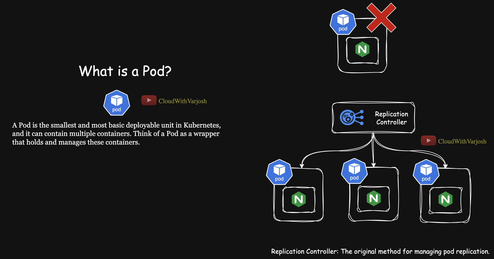
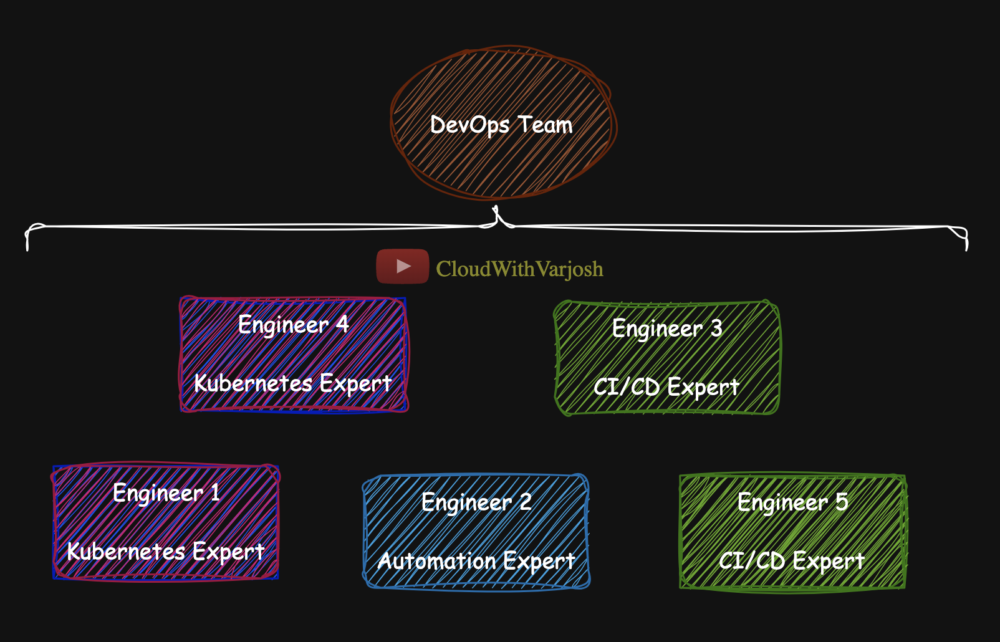
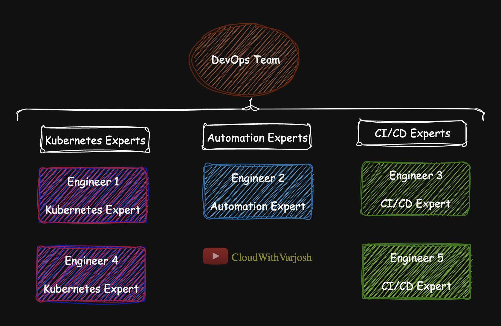
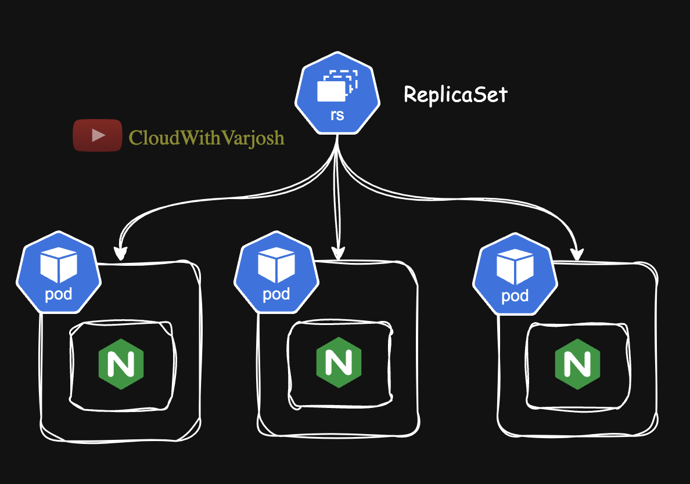
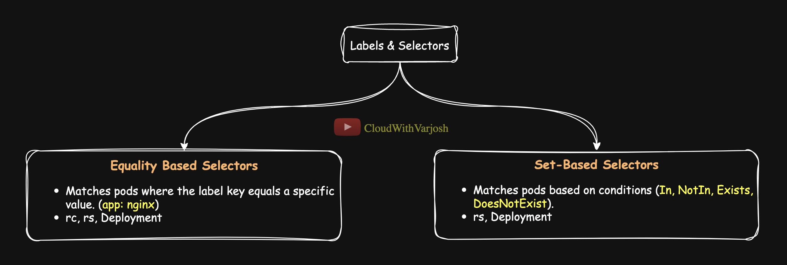
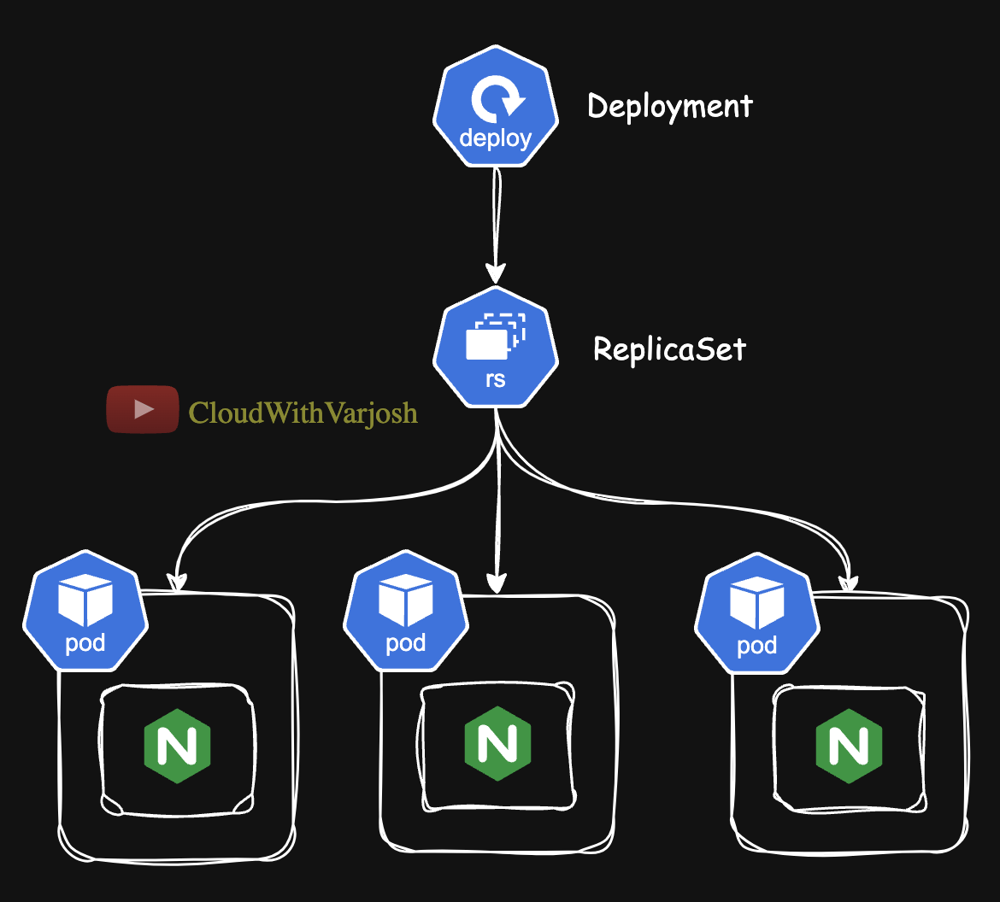

# Day 10: Replication Controller, ReplicaSets, and Deployment | CKA Certification Course 2025


# **Table of Contents**

1. [Checking Kubernetes Object Details](#1-checking-kubernetes-object-details)  
2. [ReplicationController (rc)](#2-replicationcontroller-rc)  
   - [What is a ReplicationController?](#what-is-a-replicationcontroller)  
   - [Labels and Selectors](#labels-and-selectors)  
 
3. [ReplicaSet (rs)](#3-replicaset-rs)  
   - [What is a ReplicaSet?](#what-is-a-replicaset)   
   - [Equality-Based vs Set-Based Selectors](#equality-based-vs-set-based-selectors)  
     - [Equality-Based Selector Example](#equality-based-selector-example)  
     - [Set-Based Selector Example](#set-based-selector-example)  
4. [Deployments](#4-deployments)  
   - [What is a Deployment?](#what-is-a-deployment)  
   - [How Deployments Build on rs](#how-deployments-build-on-rs)  
   - [Explaining Rolling Updates and Rollbacks in Deployments with Annotations](#explaining-rolling-updates-and-rollbacks-in-deployments-with-annotations)  

## **1. Checking Kubernetes Object Details**

To explore Kubernetes objects, use the `kubectl api-resources` command, which displays:
- **API Version** (e.g., `v1`, `apps/v1`).
- **Kind** (e.g., `ReplicationController`, `ReplicaSet`, `Deployment`).
- **Shortnames** (e.g., `rc`, `rs`, `deploy`).

```bash
kubectl api-resources
```

Example output:
```
NAME                          SHORTNAMES   APIVErsION   NAMESPACED   KIND
replicationcontrollers        rc           v1           true         ReplicationController
replicasets                   rs           apps/v1      true         ReplicaSet
deployments                   deploy       apps/v1      true         Deployment
```

This command helps you identify the API group, version, and shortnames to work with Kubernetes objects effectively.

---

## **2. ReplicationController (rc)**



### **What is a ReplicationController?**
- Ensures a specified number of pod replicas are running at any given time.
- Any pod with **matching labels** becomes part of the rc, regardless of how it was created.

### **Labels and Selectors**

**Labels**: Key-value pairs attached to Kubernetes objects like pods, enabling logical grouping and selection.  
**Selectors**: Expressions or equality-based filters used to match objects based on their labels, enabling precise control over resource management.

**Kubernetes Features That Use Labels and Selectors**:  
ReplicationController, ReplicaSet, Deployments, StatefulSets, DaemonSets, Services, Jobs, CronJobs, and NetworkPolicies. We’ll cover these in more detail as we progress through the course.
It is crucial to have a solid understanding of **labels** and **selectors**, as they will be extensively used throughout this course.

**Labels and Selectors Analogy**



Imagine you have a DevOps team consisting of 5 engineers with the following areas of expertise:

- 2 Kubernetes Experts
- 1 Automation Expert
- 2 CI/CD Experts

In this scenario, think of each area of expertise as a **label** that defines the skills of the team members. For example:

- `Kubernetes Expert`
- `Automation Expert`
- `CI/CD Expert`



If you want to **filter** the team based on a specific expertise, you can apply a **selector**. For instance:

- **Selector:** "Find all Kubernetes Experts."

By applying this filter, you'll be able to **quickly group** the engineers who have the "Kubernetes Expert" label, without needing to manually identify them.


### **rc Manifest Example**
```yaml
apiVersion: v1
kind: ReplicationController
metadata:
  name: nginx-rc
spec:
  replicas: 3
  selector:
    app: nginx
  template:
    metadata:
      name: nginx-pod
      labels:
        app: nginx
        environment: development
    spec:
      containers:
        - name: nginx-container
          image: nginx
```

### **How rc Works**


1. **Apply the rc manifest:**
   ```bash
   kubectl apply -f nginx-rc.yaml
   ```

2. **Verify the rc and its pods:**
   ```bash
   kubectl get rc
   kubectl describe rc nginx-rc
   kubectl get pods --selector app=nginx
   ```

3. **Scale the rc:**
   ```bash
   kubectl scale rc nginx-rc --replicas=4
   ```


### **Imperative Way to Create an rc (deprecated)**
```bash
kubectl create rc nginx-rc --image=nginx --replicas=3
```

> **Note:** The `kubectl create rc` command was supported in earlier Kubernetes versions, but it has been removed from the `kubectl` CLI as ReplicationControllers are now rarely used and largely replaced by ReplicaSets and Deployments. While RCs can still be created declaratively via YAML, the imperative shortcut no longer exists in modern `kubectl` versions.

---

## **3. ReplicaSet (rs)**



### **What is a ReplicaSet?**
- ReplicaSet is an improved version of ReplicationController.
- It supports **set-based selectors**, providing more flexibility in managing pods.
- ReplicaSets are often managed by **Deployments**, which add advanced capabilities.


### **rs Manifest Example**
```yaml
apiVersion: apps/v1
kind: ReplicaSet
metadata:
  name: nginx-rs
spec:
  replicas: 3
  selector:
    matchLabels:
      app: nginx
  template:
    metadata:
      labels:
        app: nginx
        environment: production
    spec:
      containers:
        - name: nginx-container
          image: nginx
```

**Labels and Selectors** in Kubernetes are of two categories:



- **Equality Selectors:**  
  These match resources that have a specific label with an exact value. They use the `=` or `!=` operators to check for equality.  
  Example: `app=k8s` matches resources with the label `app=k8s`.

- **Set-Based Selectors:**  
  These match resources based on a set of possible values for a label. They use operators like `in`, `notin`, and `exists` to check for membership in a set or the presence of a label.  
  Example: `role in (dev, test)` matches resources where the `role` label is either `dev` or `test`.

These categories allow you to filter resources in Kubernetes based on label values and combinations.


### **Equality-Based vs Set-Based Selectors**

| Selector Type        | Supported By          | Description                                                                                     |
|----------------------|-----------------------|-------------------------------------------------------------------------------------------------|
| **Equality-Based**   | rc, rs, Deployment    | Matches pods where the label key equals a specific value. (`app: nginx`)                       |
| **Set-Based**        | rs, Deployment        | Matches pods based on conditions (`In`, `NotIn`, `Exists`, `DoesNotExist`).

**Set-based** selectors provide a flexible and powerful way to identify and group Kubernetes objects (like Pods) based on their labels, allowing for fine-grained control and management.

#### **Equality-Based Selector Example**
```yaml
selector:
  matchLabels:
    app: nginx
```

#### **Set-Based Selector Example**

Here’s an improved version with clearer examples and more detailed descriptions:

| **Operator**   | **Description**                                                                 | **Example**                                           |
|----------------|---------------------------------------------------------------------------------|-------------------------------------------------------|
| **`In`**       | Matches if the value of the specified key is in the provided set of values.     | Pods where the label `app` is either `nginx` or `apache`. |
| **`NotIn`**    | Matches if the value of the specified key is not in the provided set of values. | Pods where the label `environment` is **not** `development`. |
| **`Exists`**   | Matches if the specified key is present, regardless of its value.               | Pods where the `tier` label is defined.              |
| **`DoesNotExist`** | Matches if the specified key is not present.                                  | Pods where the `debug` label is **not** defined.      |


Here's an example of a **ReplicaSet** YAML manifest that uses the `selector` block with the criteria described earlier:

```yaml
apiVersion: apps/v1
kind: ReplicaSet
metadata:
  name: example-rs
spec:
  replicas: 3
  selector:
    matchExpressions:
      - key: app
        operator: In
        values:
          - nginx
          - apache
      - key: environment
        operator: NotIn
        values:
          - development
      - key: tier
        operator: Exists
      - key: debug
        operator: DoesNotExist
  template:
    metadata:
      labels:
        app: nginx
        environment: production
        tier: frontend
        # Do not add a "debug" label here; it will break the selector condition.
    spec:
      containers:
        - name: nginx-container
          image: nginx
```

### Explanation:
1. **`.selector.matchExpressions`**: Defines the rules for selecting pods:
   - Includes pods where:
     - `app` is `nginx` or `apache`.
     - `environment` is **not** `development`.
     - `tier` label exists.
     - `debug` label does not exist.

2. **`.template.metadata.labels`**:
   - Assigns labels to the pods created by the ReplicaSet. These labels must satisfy the rules in `.selector.matchExpressions`.

3. **Pods Created**:
   - Pods created by this ReplicaSet will:
     - Have labels `app: nginx`, `environment: production`, and `tier: frontend`.
     - Not include the `debug` label.

4. **Replicas**:
   - The ReplicaSet will maintain **3 replicas** of the specified pods.

---

## **4. Deployments**



### **What is a Deployment?**
- Deployments build on top of ReplicaSets.
- They provide advanced features such as:
  - **Rolling updates** and rollbacks.
  - Automated updates to pods.
  - Simplified scaling and management.


### **Deployment Manifest Example**
```yaml
apiVersion: apps/v1
kind: Deployment
metadata:
  name: nginx-deployment
spec:
  replicas: 3
  selector:
    matchLabels:
      app: nginx
  template:
    metadata:
      labels:
        app: nginx
    spec:
      containers:
        - name: nginx-container
          image: nginx
```


### **How Deployments Build on rs**
- Deployments manage ReplicaSets and create a new version whenever updated.
- This enables **rolling updates** without downtime.

### Explaining Rolling Updates and Rollbacks in Deployments with Annotations

**What Are Annotations in Kubernetes?**

Annotations in Kubernetes are key-value pairs used to attach arbitrary metadata to Kubernetes objects. Unlike labels (which are used for selection and grouping), annotations are intended for non-identifying information that helps tools, scripts, or humans understand the purpose, context, or other details of the object.

#### **Key Characteristics of Annotations:**
- They do not affect the behavior of the Kubernetes object directly.
- They are primarily used for informational or operational metadata.
- They can hold small amounts of arbitrary data, such as:
  - Deployment changes  
  - Build information  
  - Links to external resources  
  - Operational notes or logs


We'll demonstrate rolling updates and rollbacks in a Kubernetes Deployment using the following steps:

---

#### **Step 1: Deployment YAML**
Here’s the initial Deployment YAML:

```yaml
apiVersion: apps/v1
kind: Deployment
metadata:
  annotations:
    kubernetes.io/change-cause: "Initial release with nginx 1.19"
  name: nginx-deployment
spec:
  replicas: 3
  selector:
    matchLabels:
      app: nginx
  template:
    metadata:
      labels:
        app: nginx
    spec:
      containers:
      - name: nginx-container
        image: nginx:1.19
```

- The annotation `kubernetes.io/change-cause` is added to track changes.
- This Deployment uses **nginx version 1.19**.

---

#### **Step 2: Verify the Annotation and Revision**
After applying the Deployment, verify the annotation and revision history:

```bash
kubectl rollout history deployment nginx-deployment
```

Example Output:
```
deployment.apps/nginx-deployment
REVISION  CHANGE-CAUSE
1         Initial release with nginx 1.19
```

- **Revision 1** is now annotated with the change cause provided in the YAML.

---

#### **Step 3: Upgrade to nginx 1.20**
Upgrade the nginx container to **1.20** using the following command:

```bash
kubectl set image deployment nginx-deployment nginx-container=nginx:1.20
```

**NOTE**: When you imperatively update the image for a pod managed by a **ReplicationController (rc)**, the RC does **not** perform a rolling update. Instead, it retains the existing pods, and only newly created pods will use the updated image.  
The same applies to **ReplicaSets (rs)** when used **without a Deployment**—existing pods are not replaced immediately, and only new pods will have the updated image.

Add an **annotation** to describe the change:

```bash
kubectl annotate deployments.apps nginx-deployment kubernetes.io/change-cause="Upgraded nginx 1.19 to 1.20"
```

In a production environment, you should update the **Deployment manifest** with the **change cause** and the **new image version**, then apply the updated manifest. This ensures that your configuration remains consistent, version-controlled, and follows a **declarative approach**.

Verify the rollout history to confirm the new revision and annotation:

```bash
kubectl rollout history deployment nginx-deployment
```

Example Output:
```
deployment.apps/nginx-deployment
REVISION  CHANGE-CAUSE
1         Initial release with nginx 1.19
2         Upgraded nginx 1.19 to 1.20
```

- You can also view the annotation using the command:

```bash
kubectl describe deployment nginx-deployment
```

---

#### **Step 4: Upgrade to nginx 1.21**
Further upgrade the container to **1.21**:

```bash
kubectl set image deployment nginx-deployment nginx-container=nginx:1.21
```

Annotate the deployment with the reason for this change:

```bash
kubectl annotate deployments.apps nginx-deployment kubernetes.io/change-cause="Upgraded nginx 1.20 to 1.21"
```

Verify the rollout history:

```bash
kubectl rollout history deployment nginx-deployment
```

Example Output:
```
deployment.apps/nginx-deployment
REVISION  CHANGE-CAUSE
1         Initial release with nginx 1.19
2         Upgraded nginx 1.19 to 1.20
3         Upgraded nginx 1.20 to 1.21
```

---

#### **Step 5: Perform a Rollback**

To demonstrate rollback:
1. `--to-revision` flag is required when rolling back to a specific revision. You can skip the `--to-revision` flag in case you're going to the previous revision.
2. Roll back to **nginx 1.19** (revision 1):

```bash
kubectl rollout undo deployment nginx-deployment --to-revision=1
```
**Good to know**

Every time you update a deployment (e.g., by using `kubectl set` to update the image), Kubernetes creates a new ReplicaSet in the background. The previous ReplicaSet's replica count is scaled down to `0`, and the new ReplicaSet is scaled up to the desired number of replicas. 

When you perform a rollback, Kubernetes scales down the current ReplicaSet to `0` and scales up the ReplicaSet associated with the revision you're rolling back to, effectively switching the active ReplicaSet to the previous version.

---

#### **Step 6: Verify the Rollback**
After the rollback, verify the changes:

```bash
kubectl describe deployment nginx-deployment
```

Re-check the rollout history to confirm that the Deployment is rolled back to the correct revision.

---

### Key Pointers:
1. Always annotate deployments with `kubernetes.io/change-cause` to track changes for easier management and debugging.
2. Use `kubectl rollout history` to view revision details.
3. Rollbacks can be performed to any revision using the `--to-revision` flag.

### Important Kubernetes Deployment Commands

Got it! Here's the improved one-liner list for Kubernetes Deployment commands:  

- **Create a deployment Imperatively:** `kubectl create deployment nginx-deployment --image=nginx:1.19`  
- **List all deployments:** `kubectl get deployments`  
- **Describe a deployment:** `kubectl describe deployment nginx-deployment`  
- **Update deployment image:** `kubectl set image deployment/nginx-deployment nginx-container=nginx:1.20`  
- **Scale deployment replicas:** `kubectl scale deployment/nginx-deployment --replicas=5`  
- **View rollout history:** `kubectl rollout history deployment/nginx-deployment`  
- **Annotate a deployment:** `kubectl annotate deployment nginx-deployment kubernetes.io/change-cause="Upgraded nginx 1.19 to 1.20"`  
- **Rollback to a previous revision:** `kubectl rollout undo deployment/nginx-deployment --to-revision=1` 
- **Edit a deployment:**  `kubectl edit deployment <deployment_name>`
- **Get deployment manifest in YAML format:** `kubectl get deployment <deployment_name> -o yaml`
- **Delete a deployment:** `kubectl delete deployment nginx-deployment` 

**Why `Pause` and then `Resume` a Deployment**
Pausing a deployment is useful for temporarily halting the rollout process. Key reasons include:

- **Making multiple changes**: If you need to adjust various aspects of your application, pausing lets you queue changes and apply them all at once upon resuming, avoiding multiple partial rollouts.  
- **Investigating issues**: If a problem arises during the rollout, pausing allows time to investigate and fix the issue before proceeding.  

Resuming the deployment continues the rollout from where it was paused, ensuring all pending changes are applied.

---

## **5. Key Differences Between rc, rs, and Deployments**

| Feature                | ReplicationController (rc) | ReplicaSet (rs)             | Deployment                        |
|------------------------|----------------------------|-----------------------------|-----------------------------------|
| **Selectors**          | Equality-based only        | Equality and set-based      | Equality and set-based           |
| **Updates**            | Manual                    | Manual                      | Automated (rolling updates)       |
| **Scaling**            | Manual or imperative       | Manual or imperative        | Declarative and automated         |
| **Use Case**           | Legacy workloads          | Modern workloads            | Advanced workloads with CI/CD     |

---

## **6. References**
- [Labels and Selectors](https://kubernetes.io/docs/concepts/overview/working-with-objects/labels/)
- [ReplicationController](https://kubernetes.io/docs/concepts/workloads/controllers/replicationcontroller/)
- [ReplicaSet](https://kubernetes.io/docs/concepts/workloads/controllers/replicaset/)
- [Deployment](https://kubernetes.io/docs/concepts/workloads/controllers/deployment/)
- [kubcectl Quick-Reference](https://kubernetes.io/docs/reference/kubectl/quick-reference/)