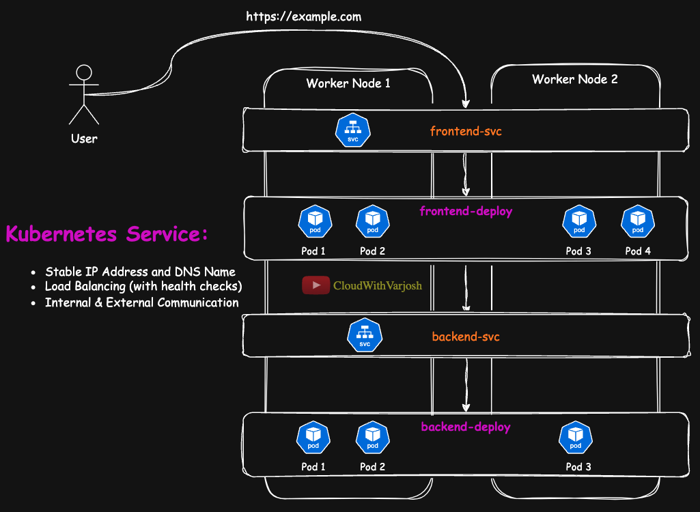
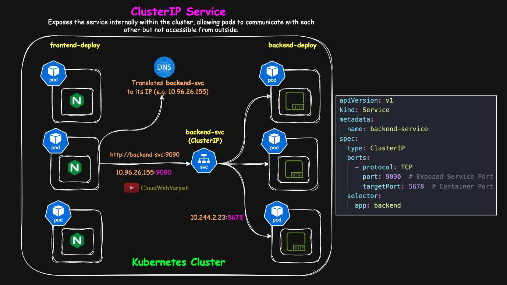
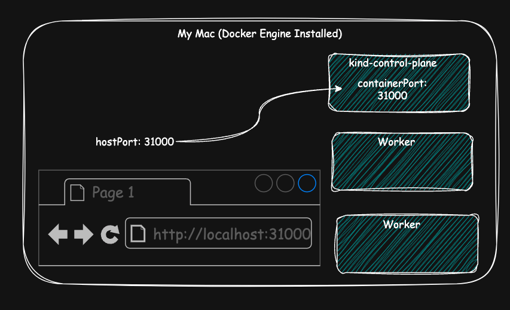
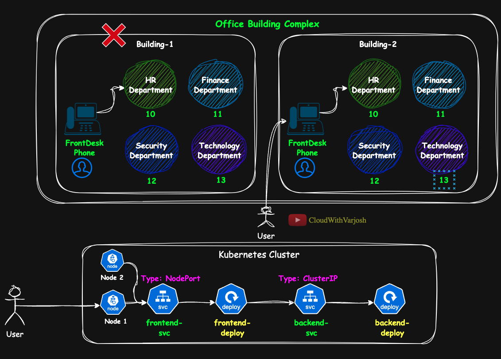
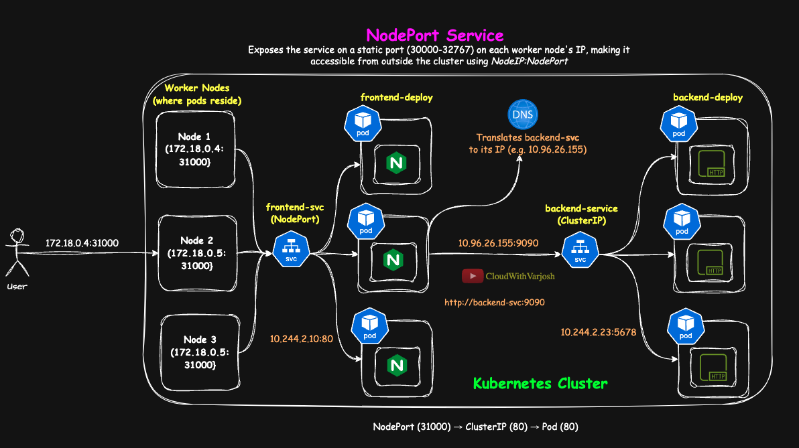
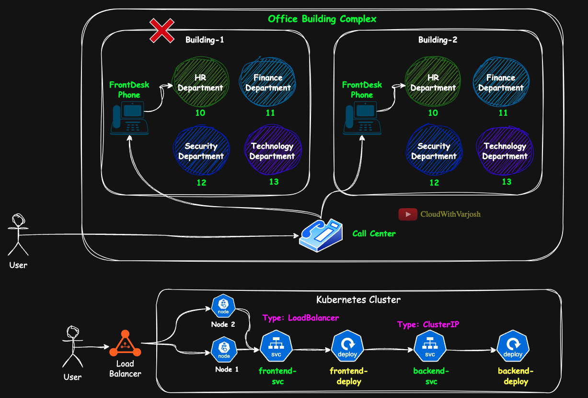
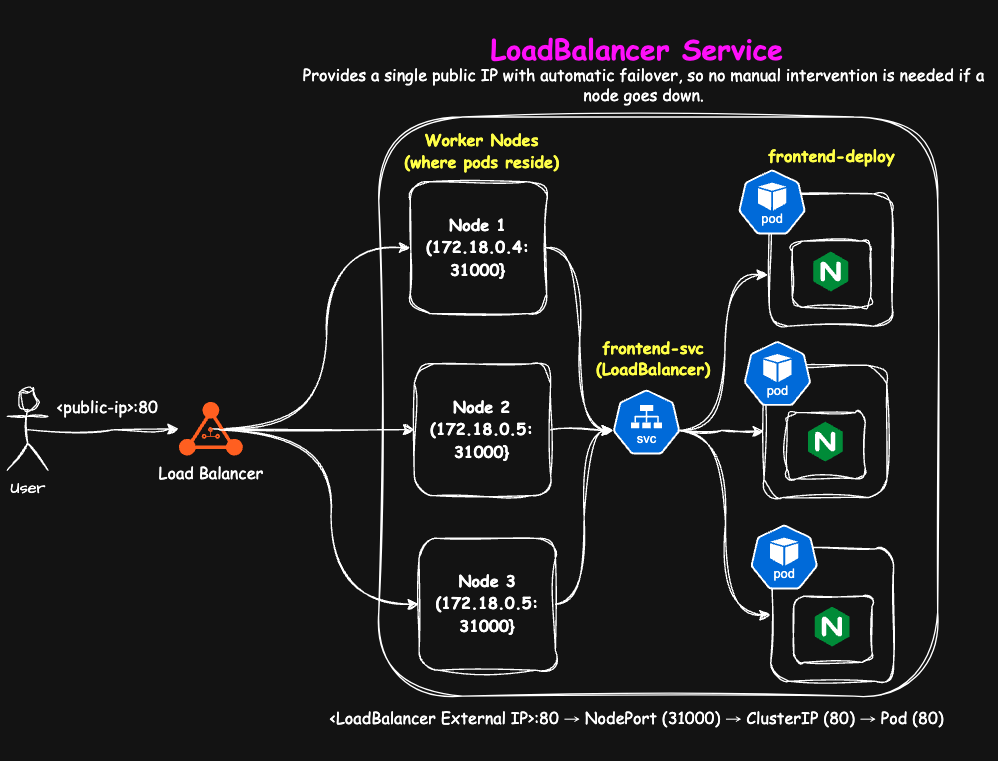
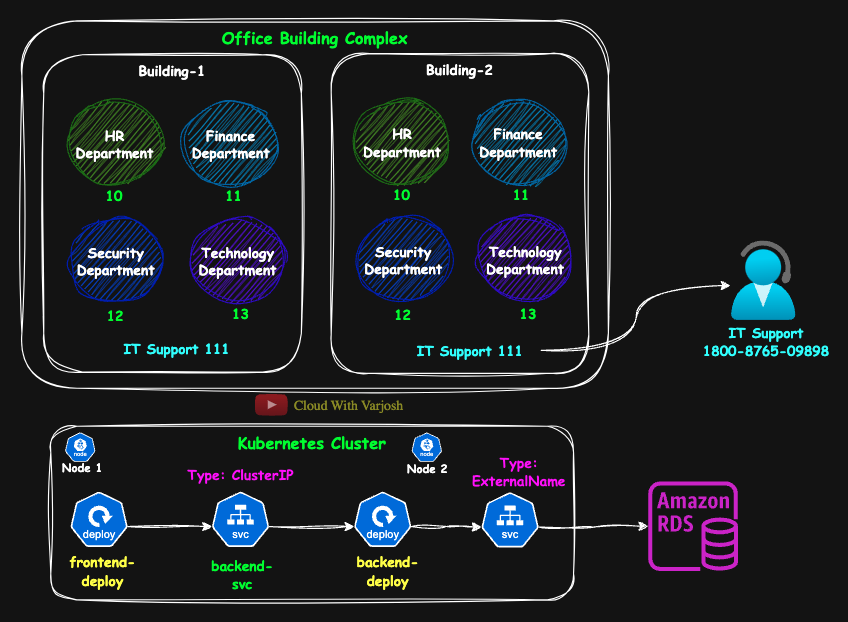
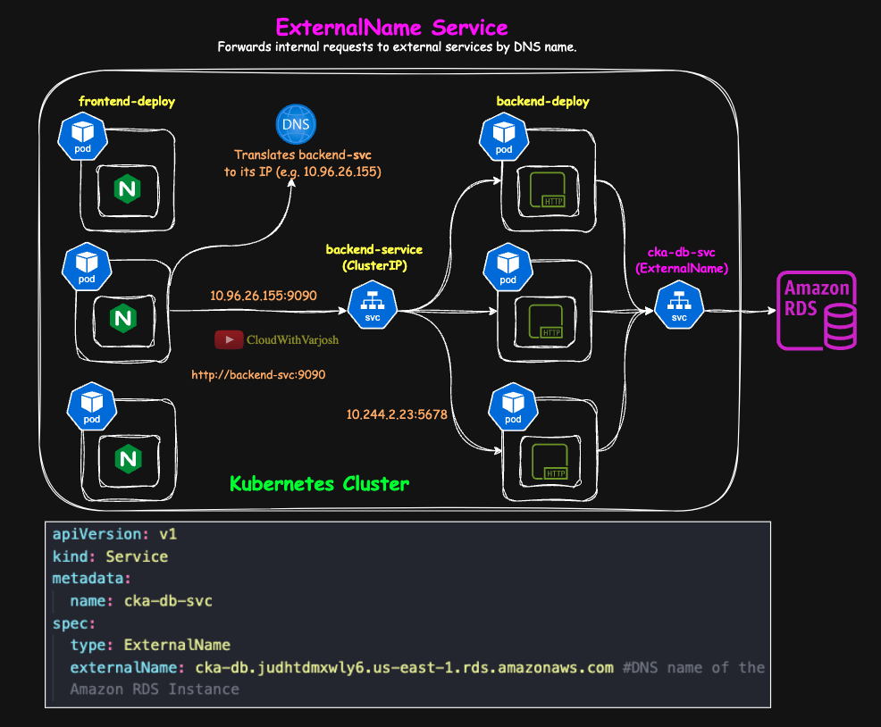

# Day 12: Kubernetes Services IN-DEPTH | ClusterIP, NodePort, LoadBalancer, ExternalName | CKA Course 2025

# Table of Contents

1. [Why Do We Need Services (svc) in Kubernetes?](#why-do-we-need-services-svc-in-kubernetes)

2. [Understanding **ClusterIP Service** in Kubernetes](#understanding-clusterip-service-in-kubernetes)
3. [Setting Up a KIND Cluster with NodePort Service](#setting-up-a-kind-cluster-with-nodeport-service)
4. [Understanding **NodePort Service** in Kubernetes](#understanding-nodeport-service-in-kubernetes)
5. [Understanding **LoadBalancer Service** in Kubernetes](#understanding-loadbalancer-service-in-kubernetes)
6. [Understanding **ExternalName Service** in Kubernetes](#understanding-externalname-service-in-kubernetes)
7. [Summary of the Request Flow Through Each Service Type](#summary-of-the-request-flow-through-each-service-type)
8. [Key Takeaways](#key-takeaways-1)


# **Why Do We Need Services (svc) in Kubernetes?**  

Before diving into **Kubernetes Services**, let’s first understand **why we need them** in the first place.  


## The Problem: How Do Pods Communicate?
In Kubernetes, applications run inside **pods**, and these pods are **ephemeral**—they can be created, destroyed, and rescheduled dynamically. This introduces two major challenges:  

### Challenge 1: Pod IPs Keep Changing
- Every time a pod is restarted, it gets **a new IP address**.  
- If another pod wants to communicate with it, **hardcoding the IP won’t work** since it keeps changing.  

### Challenge 2: Pods Need to Expose Their Services
- Some pods need to be **accessible from other pods within the cluster** (internal communication).  
- Some pods need to be **accessible from outside the cluster** (external communication).  
- Kubernetes doesn’t automatically handle this, so we need a way to ensure reliable **pod-to-pod and external access**.  

## The Solution: Kubernetes Services 

A **Kubernetes Service** acts as a **stable communication endpoint** for pods. It provides:  

- **A fixed IP and DNS name** so that pods can always be found, even if their individual IPs change.  
- **Load balancing** across multiple pod replicas to distribute traffic evenly.  
- **Internal and external communication**—services allow pods to communicate **within the cluster** and expose applications **to the outside world** when needed.  


## Example: How Services Enable Communication in Kubernetes

Let’s say we have a **frontend application** that needs to communicate with a **backend API**. Here’s how Kubernetes Services help:  

### Step-1: User Requests the Frontend Application  
- A user visits `https://example.com`.  
- The request is received by **frontend-svc** (Frontend Service).  
- **frontend-svc** forwards the request to one of the running pods in **frontend-deploy**.  

### Step-2: Frontend Communicates with Backend
- The frontend needs data from the backend.  
- The frontend pods do **not know the backend pod IPs** because they are dynamic.  
- Instead, the frontend calls `http://backend-svc` (Backend Service).  
- **backend-svc** forwards the request to one of the backend pods running inside **backend-deploy**.  


## Visualizing Service-Based Communication

### Without Services (Doesn’t Work)
```
User ---> Frontend Pod (IP keeps changing) ---> Backend Pod (IP keeps changing)
```
Pods can’t reliably communicate because IPs change dynamically.

### **With Services (Works)**
```
User ---> frontend-svc ---> Frontend Pod ---> backend-svc ---> Backend Pod
```
- **frontend-svc** provides a stable entry point for the frontend.  
- **backend-svc** allows frontend pods to reliably communicate with backend pods.  


## **Key Takeways:**  
- Kubernetes **does not provide automatic communication between pods**—we need **Services** to enable **stable, reliable networking**.  
- **Services solve two main problems**:  
  - Pods have **dynamic IPs**, so services provide a **fixed IP and DNS name**.  
  - Services allow **internal communication** between pods and **external access** when needed.  
- **Example:**  
  - A **frontend-service** allows users to access the frontend.  
  - A **backend-service** ensures the frontend can communicate with backend pods.  

---

# Understanding ClusterIP Service in Kubernetes

## What is a ClusterIP Service?
A **ClusterIP** service is the default type of Kubernetes service that exposes applications **internally** within the cluster. It allows communication between different pods using an automatically assigned **internal IP address**, making it ideal for inter-service communication.

### **Analogy:**  


To make understanding **Kubernetes Services** easier, we'll use an **office building complex analogy** throughout this guide. Here's how the analogy maps to Kubernetes concepts:  

| **Analogy Component**           | **Kubernetes Concept**                                      |  
|--------------------------------|-------------------------------------------------------------|  
| **Office Building Complex**     | **Kubernetes Cluster**                                      |  
| **Individual Buildings**        | **Nodes (Worker/Control Plane Nodes)**                      |  
| **Departments (HR, Finance)**   | **Pods (Running Containers)**                               |  
| **Internal Phone Extensions**   | **ClusterIP Services (Internal Communication)**             |  
 

There is an **office building complex** with **two buildings**: **Building-1** and **Building-2**. Each building has **four departments**: **HR, Finance, Security, and Technology**, with **extensions 10, 11, 12, and 13**, respectively.  

- The **HR department** can reach the **Finance department** by **dialing extension 11**, and so on.  
- This **internal phone system** only works **within the building complex**—no **external calls** are allowed.  

### **Relating to Kubernetes:**  
A **ClusterIP service** allows **pods within the cluster** to communicate with each other using **internal-only IPs**, much like using **internal extensions** within the office complex.  

```plaintext
HR (Pod) → Extension 11 (ClusterIP) → Finance (Pod)
```

### **Key Characteristics of ClusterIP Service**  
- **Internal-Only Access** – The service is accessible **only within the Kubernetes cluster** and cannot be reached from outside.  
- **Automatic DNS Resolution** – Kubernetes assigns a **stable DNS name** (e.g., `backend-svc`) that other pods can use instead of an IP address.  
- **Load Balancing Across Pods** – kube-proxy **distributes traffic** among the healthy backend pods associated with the service.  
- **Simplifies Pod Communication** – Enables seamless **service-to-service** communication without requiring pod IPs, which are dynamic and can change.  

## **Example: Demonstrating ClusterIP with Frontend (NGINX) and Backend (http-echo)**  



### **Architecture Overview**  
We will create a **two-tier application** where:  
1. **Frontend:** Runs an NGINX container on port 80.  
2. **Backend:** Runs a simple HTTP server using the `hashicorp/http-echo` image on port 5678. This server responds with a static message.  

### **How the Frontend Communicates with the Backend**  
- The frontend pods (NGINX) will communicate with the backend using the service name **`backend-svc:9090`**.  
- **CoreDNS** resolves `backend-svc` to its ClusterIP (e.g., `10.96.26.155`).  
- The request is then forwarded to one of the backend pods by **kube-proxy**.  
- In our example the request is forwarded to the 3rd pod (`10.244.2.23:5678`)

## **Deploying the Frontend and Backend**  

### **Frontend Deployment (NGINX)**  
```yaml
apiVersion: apps/v1
kind: Deployment
metadata:
  name: frontend-deploy
spec:
  replicas: 3
  selector:
    matchLabels:
      app: frontend
  template:
    metadata:
      labels:
        app: frontend
    spec:
      containers:
        - name: frontend-container
          image: nginx
```

### **Backend Deployment (http-echo)**  
```yaml
apiVersion: apps/v1
kind: Deployment
metadata:
  name: backend-deploy
spec:
  replicas: 3
  selector:
    matchLabels:
      app: backend
  template:
    metadata:
      labels:
        app: backend
    spec:
      containers:
      - name: backend-container
        image: hashicorp/http-echo
        args:
          - "-text=Hello from Backend"
```

### **Backend Service (ClusterIP)**  
```yaml
apiVersion: v1
kind: Service
metadata:
  name: backend-svc
spec:
  type: ClusterIP
  ports:
    - protocol: TCP
      port: 9090  # Exposed Service Port
      targetPort: 5678  # Container Port
  selector:
    app: backend
```


## **Key Takeaways:**  
- A **ClusterIP service** is used for **internal** communication within a Kubernetes cluster.  
- **CoreDNS** resolves service names to their **ClusterIP**.  
- **kube-proxy** manages traffic routing and load balances requests across multiple backend pods.  
- This example demonstrated how an NGINX frontend interacts with an HTTP backend using a ClusterIP service.  

---

# **Setting Up a KIND Cluster with NodePort Service**  

In this guide, we will set up a **Kubernetes cluster using KIND (Kubernetes IN Docker)** and configure it to allow external access to a **NodePort service**.  


## **Step 1: Check Existing KIND Clusters**
Before creating a new KIND cluster, check if any existing clusters are running:  
```sh
kind get clusters
```
This command lists all existing KIND clusters.  

## **Step 2: Delete the Existing Cluster (If Any)**
To ensure a clean setup, delete the existing KIND cluster before proceeding:  
```sh
kind delete cluster --name my-first-cluster
```
This removes the old cluster (`my-first-cluster`) and frees up resources.  

## **Step 3: Create a New KIND Cluster**
### **3.1 Use the Below Configuration File (`kind-cluster.yaml`)**

```sh
kind create cluster --name my-second-cluster --config kind-cluster.yaml
```

```yaml
kind: Cluster
apiVersion: kind.x-k8s.io/v1alpha4

# Specify the Kubernetes version by using a specific node image
# Visit https://hub.docker.com/r/kindest/node/tags and https://github.com/kubernetes-sigs/kind/releases for available images

nodes:
  - role: control-plane
    image: kindest/node:v1.31.4@sha256:2cb39f7295fe7eafee0842b1052a599a4fb0f8bcf3f83d96c7f4864c357c6c30 # Replace with the Kubernetes version you want
    extraPortMappings:
      - containerPort: 31000 # Port inside the KIND container
        hostPort: 31000 # Port on your local machine (host system). 
        # If this were set to 9090, you would access the service at localhost:9090, 
        # and traffic would be forwarded to containerPort 31000 inside the KIND cluster.
  - role: worker
    image: kindest/node:v1.31.4@sha256:2cb39f7295fe7eafee0842b1052a599a4fb0f8bcf3f83d96c7f4864c357c6c30
  - role: worker
    image: kindest/node:v1.31.4@sha256:2cb39f7295fe7eafee0842b1052a599a4fb0f8bcf3f83d96c7f4864c357c6c30
```

### **Create the Cluster Using This Configuration**
Run the following command to create a new KIND cluster using the configuration file:  
```sh
kind create cluster --name my-second-cluster --config kind-cluster.yaml
```

This creates a **three-node cluster** with one control plane node and two worker nodes. The **extraPortMappings** section allows **NodePort services** to be accessed from the host machine.  

## **Understanding `extraPortMappings` Configuration**


```yaml
extraPortMappings:
  - containerPort: 31000
    hostPort: 31000
```
### **Breakdown of Each Field**
- **containerPort:** The port inside the KIND container that will receive traffic.  
- **hostPort:** The port on your local machine (host system) that will be mapped to the `containerPort`.   

### **Example Use Case**
If `containerPort: 31000` is mapped to `hostPort: 31000`, then:  
- A Kubernetes **NodePort service** running inside the cluster on port **30950** will be accessible from the **host machine** at:  
  ```sh
  curl http://127.0.0.1:30950
  ```
- Traffic will be **forwarded from the host machine to the KIND cluster**, allowing easy access to services running inside the cluster.  

This setup enables **exposing Kubernetes services using NodePort** while ensuring they are accessible from the **local machine** without needing complex networking configurations.

# **Understanding NodePort Service in Kubernetes**  

## **What is a NodePort Service?**  
A **NodePort** service in Kubernetes allows **external access** to pods using a **worker node’s IP address** and a fixed port. Unlike a **ClusterIP** service, which is only accessible **inside the cluster**, a NodePort service makes applications available from **outside the cluster** using the format:  

```plaintext
http://<NodeIP>:<NodePort>
```
### **Analogy:**  



To make understanding **Kubernetes Services** easier, we'll use an **office building complex analogy** throughout this guide. Here's how the analogy maps to Kubernetes concepts:  

| **Analogy Component**           | **Kubernetes Concept**                                      |  
|--------------------------------|-------------------------------------------------------------|  
| **Office Building Complex**     | **Kubernetes Cluster**                                      |  
| **Individual Buildings**        | **Nodes (Worker/Control Plane Nodes)**                      |  
| **Departments (HR, Finance)**   | **Pods (Running Containers)**                               |  
| **Internal Phone Extensions**   | **ClusterIP Services (Internal Communication)**             |  
| **Front Desk Phone Numbers**    | **NodePort Services (External Access to Nodes)**            |  


The **office building complex** still has **two buildings** with **four departments** in each: **HR, Finance, Security, and Technology** (**extensions 10, 11, 12, and 13**).  

- Each building now also has a **front-desk phone number**.  
- An **external caller** needs to have the **front desk numbers of both buildings** to ensure they can **reach any department** even if **one building is not functioning**.  
- When an external user calls the **front desk**, the **receptionist** **forwards the call** to the **correct department using internal extensions**.  

### **Relating to Kubernetes:**  
A **NodePort service** exposes **internal ClusterIP services** externally via a **fixed port on each worker node**. If **one node goes down**, the user must **manually switch to another node’s IP**.  


```plaintext
User → Building-1 Front Desk (NodePort) → Extension 10 (ClusterIP) → HR (Pod)

If Building-1 is down:
User → Building-2 Front Desk (NodePort) → Extension 10 (ClusterIP) → HR (Pod)
```

### **Key Characteristics of NodePort Service**
- **External Access** – Allows users outside the cluster to access a service using `NodeIP:NodePort`.  
- **Works Across All Nodes** – The service is available on **every worker node**, regardless of where the actual pods are running.  
- **Built on ClusterIP** – Internally, a **NodePort service forwards requests to a ClusterIP service**, which then routes traffic to the correct pod.  
- **Fixed Port Range (30000-32767)** – NodePort services use a **predefined range** to avoid conflicts with system and ephemeral ports. This range is configurable, but it’s **best practice** to keep it unchanged unless necessary.  

**Note:**
With both **NodePort** and **LoadBalancer services** (to be discussed later), you can **choose not to explicitly specify the NodePort** in your **YAML manifest**. If you **omit the `nodePort` field**, **Kubernetes** will **automatically assign a port** from the **default NodePort range (30000-32767)**.  

However, in this course, I have **explicitly defined the NodePort as `31000`** in **all examples**. This is because we are using a **KIND (Kubernetes IN Docker) cluster**, and our **KIND configuration** only **exposes port 31000** to the **host machine**. This configuration ensures that **external access works consistently** and **avoids potential port conflicts**.  

By **manually specifying the port**, we maintain **control and predictability** over the **service exposure**, which is especially **important for learning environments** and **local testing scenarios**.


### **Exposing a Frontend Application Using a NodePort Service**  

Let's deploy a **frontend application** and expose it using a **NodePort service**.  

### **Step 1: Frontend Deployment (`frontend.yaml`)**
```yaml
apiVersion: apps/v1
kind: Deployment
metadata:
  name: frontend-deploy
spec:
  replicas: 3
  selector:
    matchLabels:
      app: frontend
  template:
    metadata:
      labels:
        app: frontend
    spec:
      containers:
      - name: frontend-container
        image: nginx:latest
        ports:
        - containerPort: 80  # NGINX serves content on port 80
```

### **Step 2: Frontend NodePort Service (`frontend-service.yaml`)**
```yaml
apiVersion: v1
kind: Service
metadata:
  name: frontend-svc
spec:
  type: NodePort
  selector:
    app: frontend
  ports:
    - protocol: TCP
      port: 80         # ClusterIP service port
      targetPort: 80   # Container's port inside the pod
      nodePort: 31000  # Exposed externally (must be in 30000-32767)
```

This service exposes the frontend using the NodePort **`31000`** on all worker nodes.

## **How a NodePort Service Handles Requests (Step-by-Step Flow)**  



Let’s assume:  
- A worker node has the IP **172.18.0.4**.  
- The **NodePort is 31000**.  
- The **ClusterIP assigned to `frontend-svc` is `10.96.45.120`**.  
- A **frontend pod (`frontend-pod3`) has the IP `10.244.2.10`**.  

### **Request Flow:**
1. **User accesses the frontend service using**:  
   ```plaintext
   http://172.18.0.4:31000
   ```
2. The NodePort service (`frontend-svc`) listens on all worker nodes and forwards the request to its ClusterIP (`10.96.45.120:80`).  
3. The ClusterIP service load balances the request and forwards it to a running frontend pod (e.g., `frontend-pod3` at `10.244.2.10:80`).  
4. The frontend pod processes the request and responds back to the user.

**Because the NodePort service is available on all worker nodes, the user could also access the frontend using any other worker node’s IP, for example:**  
```sh
curl http://172.18.0.5:31000
```

---

# **Understanding LoadBalancer Service in Kubernetes**  

### **What is a LoadBalancer Service?**  
A **LoadBalancer service** provides a **single, external IP address** to expose applications to the **internet**. It **builds on top of NodePort and ClusterIP services**, offering **automatic load balancing and failover**.  

### **Analogy:**  



To make understanding **Kubernetes Services** easier, we'll use an **office building complex analogy** throughout this guide. Here's how the analogy maps to Kubernetes concepts:  

| **Analogy Component**           | **Kubernetes Concept**                                      |  
|--------------------------------|-------------------------------------------------------------|  
| **Office Building Complex**     | **Kubernetes Cluster**                                      |  
| **Individual Buildings**        | **Nodes (Worker/Control Plane Nodes)**                      |  
| **Departments (HR, Finance)**   | **Pods (Running Containers)**                               |  
| **Internal Phone Extensions**   | **ClusterIP Services (Internal Communication)**             |  
| **Front Desk Phone Numbers**    | **NodePort Services (External Access to Nodes)**            |  
| **Call Center**                 | **LoadBalancer Service (Single External IP)**               | 

A **call center** is now set up to manage external calls:  

- The **call center** has a **single, easy-to-remember phone number**.  
- When a **user wants to reach the HR department**, they **call the call center**.  
- The **call center** automatically directs the call to **any healthy building’s front desk**.  
- The **front desk receptionist** then uses the **internal extension** to connect the call to the **HR department**.  

### **Relating to Kubernetes:**  
A **LoadBalancer service** provides a **single external IP address** and **automatically distributes incoming traffic** to **any available NodePort service** in the cluster, ensuring **high availability**.  

```plaintext
User → Call Center (LoadBalancer) → Any Front Desk (NodePort) 
      → Extension 10 (ClusterIP) → HR (Pod)
```

- When you create a **LoadBalancer service**, Kubernetes requests a **public IP** from the **cloud provider** (e.g., AWS, GCP, Azure).  
- This **public IP** is linked to the **LoadBalancer**, which then **routes traffic** to a **NodePort service** within the cluster.  
- The **NodePort service** internally uses a **ClusterIP service** to **distribute traffic** to the **pods**.  

## **LoadBalancer Service Manifest Example**  

```yaml
apiVersion: v1
kind: Service
metadata:
  name: frontend-svc
spec:
  type: LoadBalancer
  selector:
    app: my-app
  ports:
    - protocol: TCP
      port: 80         # ClusterIP Service port
      targetPort: 80    # Container port inside the pod
      nodePort: 31000   # Exposing service on this NodePort (must be within 30000-32767)
```

### **How This Works Behind the Scenes:**  



```plaintext
<LoadBalancer External IP>:80 → NodePort (31000) 
                           → ClusterIP (80) → Pod (80)
```

1. **LoadBalancer Service:** Requests a **public IP** from the **cloud provider**.  
2. **NodePort Service:** Exposes the service on **port 31000** across **all worker nodes**.  
3. **ClusterIP Service:** Manages **internal communication** between **pods**.  
4. **Pods:** Handle the **request on port 80**, serving the **application**.  

**Important Note:** You typically won't see **LoadBalancer services** used directly in production, as the load balancing requirements of modern applications are often more complex. Instead, you'll usually find **Ingress Controllers** being used, as they offer advanced traffic management features like URL-based routing, SSL termination, and host-based routing. We'll explore Ingress Controllers in detail later in this course. 

---

# **Understanding ExternalName Service in Kubernetes**  

### **What is an ExternalName Service?**  

An **ExternalName service** is a **special type of service** that **maps an internal Kubernetes service name** to an **external DNS name**.  

- It does **not create a proxy or a ClusterIP**.  
- Instead, it **returns a CNAME record** that **redirects traffic** to an **external domain**. 

### **Analogy:**  

To make understanding **Kubernetes Services** easier, we'll use an **office building complex analogy** throughout this guide. Here's how the analogy maps to Kubernetes concepts:  

| **Analogy Component**           | **Kubernetes Concept**                                      |  
|--------------------------------|-------------------------------------------------------------|  
| **Office Building Complex**     | **Kubernetes Cluster**                                      |  
| **Individual Buildings**        | **Nodes (Worker/Control Plane Nodes)**                      |  
| **Departments (HR, Finance)**   | **Pods (Running Containers)**                               |  
| **Internal Phone Extensions**   | **ClusterIP Services (Internal Communication)**             |  
| **Front Desk Phone Numbers**    | **NodePort Services (External Access to Nodes)**            |  
| **Call Center**                 | **LoadBalancer Service (Single External IP)**               |  
| **IT Support (111)**      | **ExternalName Service (Alias for External Services)**      |  

Each building has an **IT Support number**, which is **111**.  

- **Dialing 111** connects the caller **directly to an external entity** like the **IT Support**, without needing to know the **actual phone number** of the **IT department**.  

### **Relating to Kubernetes:**  
An **ExternalName service** acts as an **alias** that maps an **internal service name** to an **external DNS name**, allowing **internal pods** to **directly access external services**.  

```plaintext
User → IT Support 111 (ExternalName) → IT Support (External Service)
```

## **ExternalName Service Manifest Example**  

```yaml
apiVersion: v1
kind: Service
metadata:
  name: cka-db-svc
spec:
  type: ExternalName
  externalName: cka-db.judhtdmxwly6.us-east-1.rds.amazonaws.com # DNS name of the Amazon RDS Instance
```

### **Example Scenario:**  



Suppose your **backend pods** need to connect to an **external database** hosted on **Amazon RDS**.  

- Instead of **hardcoding the RDS DNS name** in the application, you create an **ExternalName service** called **`cka-db-svc`**.  
- The application can now **connect to the database** using:  

```plaintext
http://cka-db-svc:3306
```

### **Why is This Useful?**  

- If the **RDS instance changes** (e.g., **new DNS name** for a **new RDS instance**), only the **ExternalName service needs to be updated**, not the **application code** or **deployment configuration**.  
- This ensures **decoupling of configuration from the application**, promoting **maintainability and flexibility**.  

## **When to Use an ExternalName Service:**  

- When you need to **connect Kubernetes workloads to external services** by **using a simple alias**.  
- Ideal for **integrating with third-party APIs**, **legacy systems**, or **external databases** like **Amazon RDS**.  

---

# **Summary of the Request Flow Through Each Service Type**  

### **ClusterIP (Internal-Only Communication)**  
```plaintext
HR (Pod) → Extension 11 (ClusterIP) → Finance (Pod)
```

### **NodePort (External Access with Manual IP Management)**  
```plaintext
User → Building-1 Front Desk (NodePort) → Extension 10 (ClusterIP) → HR (Pod)

If Building-1 is down:
User → Building-2 Front Desk (NodePort) → Extension 10 (ClusterIP) → HR (Pod)
```

### **LoadBalancer (Single Public IP with Automatic Failover)**  
```plaintext
User → Call Center (LoadBalancer) → Any Available Front Desk (NodePort) 
      → Extension 10 (ClusterIP) → HR (Pod)
```

### **ExternalName (Internal Service to External Service Mapping)**  
```plaintext
Internal Call → IT Support 111 (ExternalName) → IT Support (External Service)
```

---

## **Key Takeaways:**  

- **ClusterIP:** Allows **internal-only communication** between pods.  
- **NodePort:** Adds **external access** through a **specific port on each node's IP**, but requires **manual switching** if a **node goes down**.  
- **LoadBalancer:** Provides a **single public IP** with **automatic load balancing**, ideal for **production environments**.  
- **ExternalName:** Offers a **simple alias** to connect **internal services to external resources** using **DNS names**.  
- When using **ExternalName**, applications **connect to services using internal DNS names**, and **Kubernetes handles the external redirection**.  
- This **separates configuration from application logic**, ensuring **easier maintenance** and **flexibility**.  


## **References**  

- [KIND Extra Port Mappings](https://kind.sigs.k8s.io/docs/user/configuration/#extra-port-mappings)  
- [Kubernetes Services Documentation](https://kubernetes.io/docs/concepts/services-networking/service/)  


