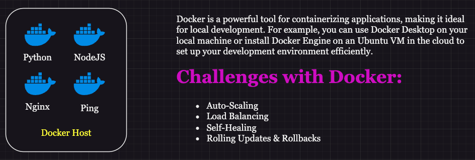
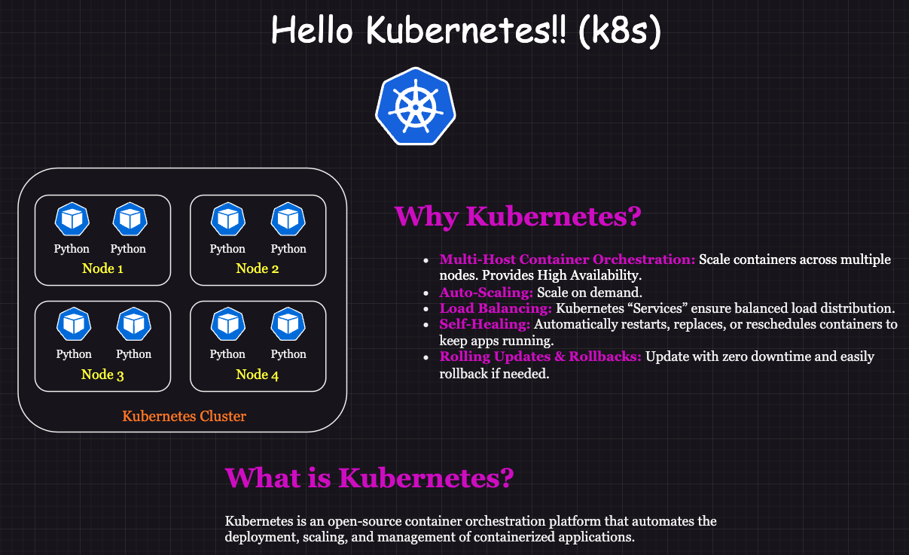

# Day 6: Hello Kubernetes! Why Kubernetes? What is Kubernetes? | CKA Certification Course 2025

## Challenges with Docker

- **Auto-Scaling**: Docker lacks native support for automatic scaling of containers based on resource utilization or demand, requiring external orchestration tools like Kubernetes to manage dynamic scaling effectively.
- **Load Balancing**: Docker does not offer built-in, sophisticated load-balancing mechanisms across multiple containers or hosts, making it reliant on third-party tools or manual configurations.
- **Self-Healing**: Docker does not have inherent self-healing capabilities to restart failed containers or maintain application stability automatically, unlike Kubernetes.
- **Rolling Updates/Rollbacks**: Docker alone cannot perform seamless rolling updates or rollbacks for applications, which is essential for maintaining zero downtime during updates or reverting changes safely.

## Hello Kubernetes!!

###  Why Kubernetes?
- Kubernetes is not just another container orchestration tool – it is the industry-standard for managing containers at scale.
- While Docker helps package and run individual containers, Kubernetes orchestrates and manages multiple containers across many machines.
- Kubernetes automates deployment, scaling, and operations of containerized applications, enabling high availability, load balancing, and self-healing.

## Kubernetes vs Docker Swarm vs Docker Compose

| **Feature**           | **Kubernetes**                                                                 | **Docker Swarm**                                                  | **Docker Compose**                                                            |
|------------------------|-------------------------------------------------------------------------------|-------------------------------------------------------------------|--------------------------------------------------------------------------------|
| **Scope**             | Orchestrates containerized applications across a **cluster of machines**, enabling automated deployment, scaling, and management | Primarily designed for managing Docker containers within a **single host** or a **small cluster**, offering basic orchestration capabilities | Used to define and run **multi-container applications** on a **single host** via simple YAML configuration |
| **Complexity**        | Highly complex due to features like resource quotas, custom schedulers, and advanced networking | Relatively simpler than Kubernetes, focusing on **basic clustering** and orchestration of Docker containers | Simplest of the three, meant for **local development** and straightforward multi-container setups |
| **Scalability**       | Designed for **large-scale, production-grade deployments**, supporting dynamic scaling across hundreds of nodes | Supports **moderate scaling**, ideal for small-to-medium-sized deployments but limited for large infrastructures | **Limited scalability**, best suited for running containers on a **single host** |
| **Features**          | Includes features like **auto-scaling**, **self-healing**, service discovery, load balancing, secrets management, and rolling updates | Offers core features like **service discovery**, **manual scaling**, and rolling updates, but lacks advanced tools like monitoring or logging | Focuses on defining services, networks, and volumes for multi-container applications in a **local environment** |
| **Learning Curve**    | Steep due to extensive configuration options, need for understanding YAML manifests, and troubleshooting at scale | Easier to learn than Kubernetes, requiring knowledge of Docker basics and basic cluster setup | Very easy to learn and use, with minimal configuration required |
| **Community and Ecosystem** | Large and **active community**, with tools like Helm, Prometheus, and Istio enriching its ecosystem | Smaller but growing community, primarily focused on Docker tooling | Large community due to its widespread use among **developers for local testing** |
| **Use Cases**         | Best for **production-grade deployments**, handling complex microservices architectures, and large-scale systems | Suitable for smaller **production-grade applications** or **testing clusters** of Docker containers | Ideal for **local development**, testing, and small, **non-critical deployments** |
| **State Management**  | Offers **stateful workloads** using StatefulSets, Persistent Volumes, and ConfigMaps for managing data | Lacks built-in support for stateful applications but can use external storage | Designed for **stateless container configurations**, but volumes can be used for data persistence |
| **Networking**        | Advanced networking features like **ClusterIP**, **NodePort**, and **Ingress controllers**, offering granular control | Basic networking, offering **internal and external networks** for container communication | Minimal networking support for defining simple service-to-service communication |
| **Installation and Setup** | Installation can be complex, requiring tools like `kubectl`, kubeadm, or managed services (e.g., EKS, GKE, AKS) | Straightforward installation, only requiring Docker to be configured in Swarm mode | Extremely simple, just requiring Docker Compose YAML files to define configurations |
| **Fault Tolerance**   | Highly fault-tolerant with automatic pod rescheduling and rolling updates      | Moderate fault tolerance with leader election and container restarts | Very limited fault tolerance; typically used for development environments rather than production |

### Key pointers covering the "Characteristics" we discussed?

| Characteristic | Kubernetes | Docker Swarm | Docker Compose |
|---|---|---|---|
| **Orchestration** | Yes (multi-host, distributed) | Yes (multi-host, within a single Swarm cluster) | No (single-host) |
| **Scaling** | Automatic and manual | Manual and limited automatic | Manual |
| **Load Balancing** | Built-in and advanced | Basic (through routing mesh) | Not built-in |
| **Self-Healing** | Yes (robust) | Limited (basic container restarts) | No |
| **Multi-Host** | Yes (across a cluster of machines) | Yes (within a single Swarm cluster) | No |
| **Networking** | Advanced (service mesh, network policies) | Basic (overlay network) | Limited (uses Docker's default networking) |
| **Use Case** | Large-scale production deployments, complex microservices | Smaller deployments, managing a cluster of Docker hosts | Local development, testing, simple deployments |