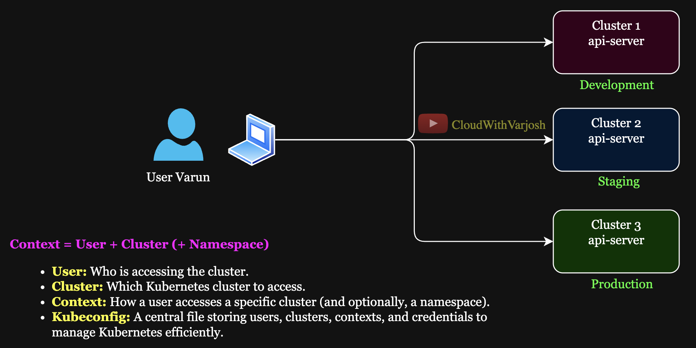
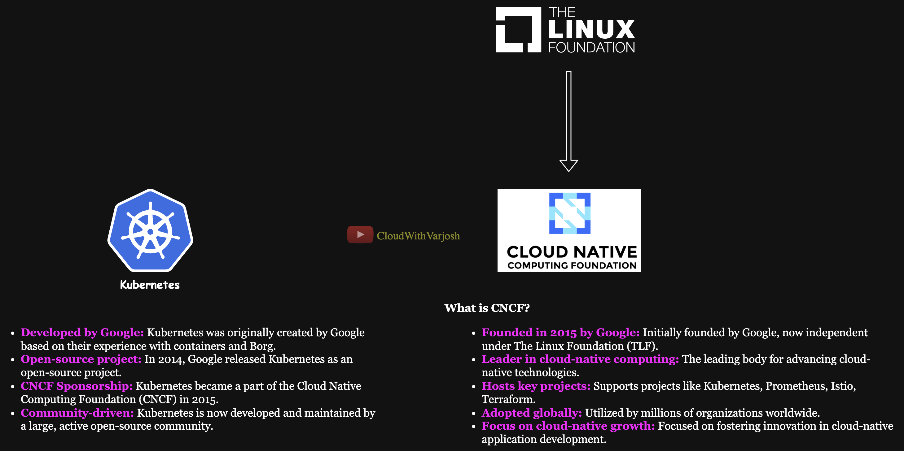

# Day 8: Setting Up Kind Cluster Locally & Kubernetes Context | CKA Certification Course 2025


# Important Installation links:

- Documentation for [Kubectl Installation ](https://kubernetes.io/docs/tasks/tools/)
- Documentation for [Kind Cluster Installation ](https://kind.sigs.k8s.io/docs/user/quick-start/)
---

# What We Did

We executed the command from the CLI to create Kubernetes clusters using **Kind** in both scenarios. Below are the key differences:

## First Scenario: *my-first-cluster*
- The cluster was created using the following command:
  ```bash
  kind create cluster --name my-first-cluster --config kind-cluster.yaml
  ```
  Here is **kind-cluster.yaml**

```yaml
# kind-cluster-config.yaml
kind: Cluster
apiVersion: kind.x-k8s.io/v1alpha4

# Specify the Kubernetes version by using a specific node image
# Visit https://hub.docker.com/r/kindest/node/tags and https://github.com/kubernetes-sigs/kind/releases for available images
nodes:
  - role: control-plane
    image: kindest/node:v1.31.4@sha256:2cb39f7295fe7eafee0842b1052a599a4fb0f8bcf3f83d96c7f4864c357c6c30 # Replace with the Kubernetes version you want
  - role: worker
    image: kindest/node:v1.31.4@sha256:2cb39f7295fe7eafee0842b1052a599a4fb0f8bcf3f83d96c7f4864c357c6c30
  - role: worker
    image: kindest/node:v1.31.4@sha256:2cb39f7295fe7eafee0842b1052a599a4fb0f8bcf3f83d96c7f4864c357c6c30
```
  A **configuration file** was used to define the cluster setup, including:
  - **Image Version** 
  - **Number of Nodes**
  
- Using configuration files is generally preferred because:
  - It allows **version control**, making it easier to track and roll back changes.
  - It follows **declarative practices**, ensuring setups are consistent, reproducible, and easier to manage across environments.
  - Configuration files can be **shared across teams**, promoting collaboration and standardization.
  - They provide a **single source of truth** for cluster configurations, reducing the risk of discrepancies or errors during manual setup.
  
- **IMPORTANT** This approach is not limited to **Kind** but is also widely applicable to other **DevOps tools** like Terraform, Ansible, Helm, and Kubernetes, which heavily rely on manifest or configuration files to define infrastructure and deployments. Administrators often prefer **YAML** for its flexibility, readability, and ease of use, although many of these tools also support other formats, such as **JSON**, to accommodate various use cases.

## Second Scenario: *my-second-cluster*
- The cluster was created using the following command:
  ```bash
  kind create cluster --name my-second-cluster
  ```
  Instead of relying on a configuration file, we directly ran the command, which:
  - Defaulted to the **latest image**.
  - Could have been customized by specifying an image using the `--image` flag.

- While quicker for simple setups, this approach lacks:
  - The **versioning benefits** provided by configuration files.
  - The **declarative advantages**, such as reproducibility and maintainability.

## Important Note About Naming in Kind
- **Kind** assigns the **same name** to the user and context as the cluster name, which might seem confusing at times. 
- In production environments, these names are typically **distinct** to avoid confusion.
- Although the next section will explain this concept theoretically, I’ll ensure to demonstrate this difference practically when we set up clusters using **kubeadm**.
---

# Managing Kubernetes Contexts for Multiple Clusters

**Kubernetes contexts** allow users to easily manage multiple clusters and namespaces by storing cluster, user, and namespace information in the `kubeconfig` file. Each context defines a combination of a cluster, a user, and a namespace, making it simple for users like `Varun` to switch between clusters and namespaces seamlessly without manually changing the configuration each time.

## Scenario:



Varun, the user, wants to access three different Kubernetes clusters from his laptop. Let's assume these clusters are:
1. **Cluster 1** (for development)
2. **Cluster 2** (for staging)
3. **Cluster 3** (for production)

Varun will need to interact with these clusters frequently. Using Kubernetes contexts, he can set up and switch between these clusters easily.

## How Kubernetes Contexts Work:

### 1. Configuring Contexts:

In the `kubeconfig` file, each cluster, user, and namespace combination is stored as a context. So, Varun can have three different contexts, one for each cluster. The contexts will contain:
- **Cluster details**: API server URL, certificate authority, etc.
- **User details**: Authentication method (e.g., username/password, token, certificate).
- **Namespace details**: The default namespace to work in for the context (though the namespace can be overridden on a per-command basis).

### 2. Switching Between Contexts:

With Kubernetes contexts configured, Varun can easily switch between them. If he needs to work on **Cluster 1**, he can switch to the `dev-context`. Similarly, for **Cluster 2**, he switches to `staging-context`, and for **Cluster 3**, the `prod-context`.

A **Kubernetes namespace** is a virtual cluster within a physical cluster that provides logical segregation for resources, enabling multiple environments (e.g., dev, staging, prod) to coexist on the same cluster. 

For example, in a cluster running multiple applications, each application can run in its own namespace, ensuring isolation and avoiding conflicts between resources like services or pods.

**NOTE:** I’ve included the namespace section here for completeness. We’ll dive deeper into working with namespaces later in the course.

## Example `kubeconfig` File:

Here's a simplified example of what the `kubeconfig` file might look like:

```yaml
apiVersion: v1
clusters:
- name: cluster-1
  cluster:
    server: https://cluster-1-api-server
    certificate-authority-data: <certificate-data>
- name: cluster-2
  cluster:
    server: https://cluster-2-api-server
    certificate-authority-data: <certificate-data>
- name: cluster-3
  cluster:
    server: https://cluster-3-api-server
    certificate-authority-data: <certificate-data>
users:
- name: varun-user
  user:
    client-certificate-data: <client-cert-data>
    client-key-data: <client-key-data>
contexts:
- name: dev-context
  context:
    cluster: cluster-1
    user: varun-user
    namespace: dev
- name: staging-context
  context:
    cluster: cluster-2
    user: varun-user
    namespace: staging
- name: prod-context
  context:
    cluster: cluster-3
    user: varun-user
    namespace: prod
current-context: dev-context
```

## Leveraging Contexts Properly:

**Switch Contexts Easily:**

Varun can switch between contexts using the following command:

```bash
kubectl config use-context <context-name>
```

**For example:**

```Bash
kubectl config use-context dev-context    # Switch to Cluster 1
kubectl config use-context staging-context # Switch to Cluster 2
kubectl config use-context prod-context   # Switch to Cluster 3
```

**Namespace Management:**

When Varun switches contexts, he can also set the default namespace. For example, when switching to prod-context, the default namespace would be prod. However, he can override this on the command line if needed:

```Bash
kubectl get pods --namespace=dev  # Override the default namespace for a command
```

**Setting a Default Namespace with `kubectl config`**

To streamline working with Kubernetes, you can set a **default namespace** for a specific context using the `kubectl config` command. This eliminates the need to specify the `--namespace` flag in every command.  

**Example: Setting a Default Namespace for Varun**

Imagine Varun is working with the **dev cluster** and wants to set the default namespace to `app1-ns`. This can be achieved with the following command:  

```bash
kubectl config set-context --current --namespace=app1-ns
```
**Keep current-context Updated:**

Varun can change the **current-context** to reflect the cluster he is working on at the moment. This is especially useful when accessing **different clusters** frequently. To check the current context:

```Bash
kubectl config current-context
```
**To list all contexts:**

```bash
kubectl config get-contexts
```
**Efficient Cluster Management:**

Using contexts, Varun can ensure that his commands (like `kubectl get pods`) are sent to the **correct cluster** without having to manually specify the cluster or user details every time. It helps to prevent mistakes where a command meant for one cluster is executed on another cluster by accident.


## Kubernetes Origin


## Additional Resources:

For the official list of resources, refer to the [Certification Resources Allowed](https://docs.linuxfoundation.org/tc-docs/certification/certification-resources-allowed#certified-kubernetes-administrator-cka-and-certified-kubernetes-application-developer-ckad). 